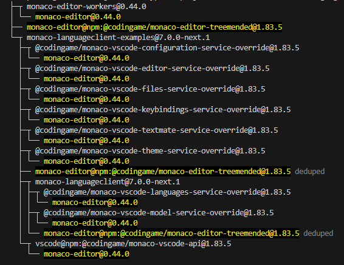
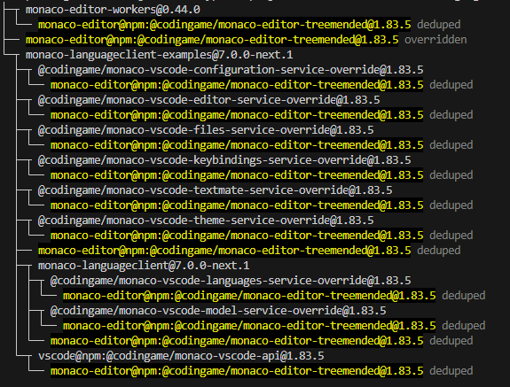

# Monaco Language Client & VSCode WebSocket Json RPC

[](https://gitpod.io#https://github.com/TypeFox/monaco-languageclient)
[](https://github.com/TypeFox/monaco-languageclient/labels/help%20wanted)
[](https://github.com/TypeFox/monaco-languageclient/actions/workflows/actions.yml)
[](https://www.npmjs.com/package/monaco-languageclient)
[](https://www.npmjs.com/package/monaco-languageclient)

Repository for [NPM module](https://www.npmjs.com/package/monaco-languageclient) to connect [Monaco editor](https://microsoft.github.io/monaco-editor/) with [language servers](https://microsoft.github.io/language-server-protocol/) and [NPM module](https://www.npmjs.com/package/vscode-ws-jsonrpc) which implements communication between a jsonrpc client and server over WebSocket.

Click [here](https://www.typefox.io/blog/teaching-the-language-server-protocol-to-microsofts-monaco-editor/) for a detail explanation how to connect the Monaco editor to your language server.

- [Monaco Language Client \& VSCode WebSocket Json RPC](#monaco-language-client--vscode-websocket-json-rpc)
  - [Getting started](#getting-started)
    - [Vite dev server](#vite-dev-server)
  - [Using monaco-languageclient](#using-monaco-languageclient)
    - [NEW with v7: Treemended monaco-editor](#new-with-v7-treemended-monaco-editor)
      - [Overrides instructions](#overrides-instructions)
    - [Using services and extra packages from @codingame/monaco-vscode-api](#using-services-and-extra-packages-from-codingamemonaco-vscode-api)
      - [textmate and monarch](#textmate-and-monarch)
  - [Examples Overview](#examples-overview)
    - [Main Examples](#main-examples)
    - [Verification Examples](#verification-examples)
      - [Pure bundler verification](#pure-bundler-verification)
    - [Example usage](#example-usage)
      - [Server processes](#server-processes)
        - [JSON Language Server](#json-language-server)
        - [Pyright Language Server](#pyright-language-server)
        - [Groovy Language Server](#groovy-language-server)
      - [Verification Example Servers](#verification-example-servers)
    - [VSCode integration](#vscode-integration)
  - [Featured projects](#featured-projects)
  - [Troubleshooting](#troubleshooting)
    - [General](#general)
    - [Dependency issues: monaco-editor / @codingame/monaco-editor-treemended](#dependency-issues-monaco-editor--codingamemonaco-editor-treemended)
    - [Volta](#volta)
    - [Vite dev server troubleshooting](#vite-dev-server-troubleshooting)
    - [Serve all files required](#serve-all-files-required)
    - [Bad Polyfills](#bad-polyfills)
      - [buffer](#buffer)
    - [monaco-editor-core](#monaco-editor-core)
    - [@monaco-editor/react](#monaco-editorreact)
    - [pnpm](#pnpm)
  - [Monaco-editor / @codingame/monaco-vscode-api compatibility table](#monaco-editor--codingamemonaco-vscode-api-compatibility-table)
  - [Important Project Changes](#important-project-changes)
  - [Changelogs](#changelogs)
  - [Licenses](#licenses)

## Getting started

On your local machine you can prepare your dev environment as follows. At first it is advised to build everything. Or, use a fresh dev environment in [Gitpod](https://www.gitpod.io) by pressing the **code now** badge above.
Locally, from a terminal do:

```bash
git clone https://github.com/TypeFox/monaco-languageclient.git
cd monaco-languageclient
npm i
# Cleans-up, compiles and builds everything
npm run build
```

### Vite dev server

Start the Vite dev server. It serves all client code at [localhost](http://localhost:8080). You can go to the [index.html](http://localhost:8080/index.html) and navigate to all client examples from there. You can edit the client example code directly (TypeScript) and Vite ensures it automatically made available:

```shell
npm run dev
```

As this is a npm workspace the main [package.json](./package.json) contains script entries applicable to the whole workspace like `watch`, `build` and `lint`, but it also contains shortcuts for launching scripts from the childe packages like `npm run build:examples`.

If you want to change the libries and see this reflected directly, then you need to run the watch command that compiles all TypeScript files form both libraries and the examples:

```shell
npm run watch
```

## Using monaco-languageclient

TODO: Section needs to be overhauled

### NEW with v7: Treemended monaco-editor

Since version 2 (see [Important Project Changes](#important-project-changes)) of this library we rely on [@codingame/monaco-vscode-api](https://github.com/CodinGame/monaco-vscode-api) to supply the vscode API. It evolved substantially since then and thesedays allows to use many vscode only services with `monaco-editor`.

Earlier in 2023 we started to treemend an existing `monaco-editor` dependency via a postinstall script. This adds back monaco-editor code that was removed during bundling/threeshaking (*treemending*). See the detailed explanation [here](https://github.com/CodinGame/monaco-vscode-api#why). But, this introduced multiple problems.

#### Overrides instructions

With v7 we decided to use readily treemended version of monaco-editor called [@codingame/monaco-vscode-editor-api](https://www.npmjs.com/package/@codingame/monaco-vscode-editor-api), but this requires to add `overrides` (npm/pnpm) and `resolutions` (yarn) in your project. Setting these ensures that all dependencies to `monaco-editor` and `vscode` are aligned:

```yaml
  "overrides": {
    "monaco-editor": "npm:@codingame/monaco-vscode-editor-api@~2.2.1"
  },
  "resolutions": {
    "monaco-editor": "npm:@codingame/monaco-vscode-editor-api@~2.2.1"
  }
```

In the following table you can see the effect when using `npm list monaco-editor` (here the [angular client example](https://github.com/TypeFox/monaco-languageclient-ng-example.git) was used to demonstrate it):

| No overrides | With overrides |
| :----         | :----   |
|  |   |

With `overrides` or `resolutions` configured any child depndencies with a another `monaco-editor` version will chnaged to the one you enforce.

This means some extra-configuration work, but removes the need for any postinstall scripts which lead to multiple package manager problems. It is now also very clear what is used and needed. Please see [Monaco-editor / @codingame/monaco-vscode-api compatibility table](#monaco-editor--codingamemonaco-vscode-api-compatibility-table) for a complete overview.

### Using services and extra packages from @codingame/monaco-vscode-api

The bespoke projects not only supplies the api, but it provides 100+ packages with additional services, default extensions and language packs. By default when initalizing `monaco-languageclient` via the required `initServices` the following services are always loaded:

- *languages* and model *services* (always added by `monaco-languagclient`)
- *layout*, *environment*, *extension*, *files* and *quickAccess* (always added by `monaco-vscode-api`)

Please check the [following link](https://github.com/CodinGame/monaco-vscode-api#monaco-standalone-services) for information about all services supplied by [@codingame/monaco-vscode-api](https://github.com/CodinGame/monaco-vscode-api).

Please check our examples [in the examples overview chapter](#examples-overview) as they demonstrate the usage (jump-start: [python client](./packages/examples/src/python/client/main.ts) for services and default extension usage or [Langium Statemachine](./packages/examples/src/langium/statemachineClient.ts) / [Locale Loader](./packages/examples/src/langium/localeLoader.ts))

#### textmate and monarch

If you use the `textmate` or `theme` services you are able to load textmate based grammars and theme definitions from vscode:

```js
import getThemeServiceOverride from '@codingame/monaco-vscode-theme-service-override';
import getTextmateServiceOverride from '@codingame/monaco-vscode-textmate-service-override';
```

Once you those services you can no longer make use of monarch based grammars and themes.

## Examples Overview

There are a couple of different examples that demonstrate how the `monaco-languageclient` can be used.

### Main Examples

- [JSON Language client and language server example](./packages/examples/src/json):
  - The **json-server** runs an external Node.js [Express app](./packages/examples/src/json/server/main.ts) where web sockets are used to enable communication between the language server process and the client web application (see [JSON Language Server](#json-language-server)).
  - The **json-client** contains the [client web app](./packages/examples/src/json/client/main.ts) which connects to the language server therefore requires the node server app to be run in parallel.

- [Python Language client and pyright language server example](./packages/examples/src/python):
  - The **python-server** runs an external Node.js [Express app](./packages/examples/src/python/server/main.ts) where web sockets are used to enable communication between the language server process and the client web application (see [Pyright Language Server](#pyright-language-server)).
  - The **python-client** contains the [client web app](./packages/examples/src/python/client/main.ts) which connects to the language server therefore requires the node server app to be run in parallel.

- [Groovy Language client and language server example](./packages/examples/src/groovy):
  - The **groovy-server** runs an external [Java app](./packages/examples/src/groovy/server/main.ts) where web sockets are used to enable communication between the language server process and the client web application ([Groovy Language Server](#groovy-language-server)).
  - The **groovy-client** contains the [client web app](./packages/examples/src/python/client/main.ts) which connects to the language server therefore requires the node server app to be run in parallel.

- Langium example:
  - Statemachine DSL (created with Langium) **statemachine-web-worker-language-server** example located in [./packages/examples/src/langium](./packages/examples/src/langium) contains both the [language client](./packages/examples/src/langium/statemachineClient.ts) and the [langauge server (web worker)](https://github.com/langium/langium/blob/main/examples/statemachine/src/language-server/main-browser.ts). The web worker example communicate via `vscode-languageserver-protocol/browser` instead of a web socket used in the **JSON examples** examples.

- The **browser** example located in [./packages/examples/src/browser](./packages/examples/src/browser) demonstrates how a [language service written in JavaScript](./packages/examples/src/browser/main.ts) can be used in a Monaco Editor contained in a simple HTML page. This example can now be considered legacy as the web worker option eases client side language server implementation and separation.

- The **react-client** example located in [./packages/examples/src/react](./packages/examples/src/react) contains the [React client](./packages/examples/src/react/main.tsx). It does the same as the regular client example but inside a React Functional Component.

- The **angular-client** example is now found in [its own repository](https://github.com/TypeFox/monaco-languageclient-ng-example.git)

**Important:** Apart from the **json-server** and **python-server** process all other will be server by the [Vite dev server](#vite-dev-server). Some examples share [common code](./packages/examples/src/common.ts) to reduce the amount of redundant code.

### Verification Examples

- The **webpack** verification example located in [./packages/verify/webpack](./packages/verify/webpack) demonstrates how bundling can be achieved with webpack. You find the configuration here: [webpack.config.js](./packages/verify/webpack/webpack.config.js).

- The **vite** verification example located in [./packages/verify/vite](./packages/verify/vite) demonstrates how bundling can be achieved with vite. There is no configuration required.

#### Pure bundler verification

- [./packages/verify/pnpm](./packages/verify/pnpm) is not part of the npm workspace. It allows to test whether `pnpm install` works as expected and it allows to test `@codingame/monaco-vscode-api` treemending via `pnpm run test:treemending`.
- [./packages/verify/yarn](./packages/verify/yarn) is not part of the npm workspace. It allows to test whether `yarn install` works as expected and it allows to test `@codingame/monaco-vscode-api` treemending via `yarn run test:treemending`.

### Example usage

#### Server processes

##### JSON Language Server

For the **json-client**, **react-client** or the **client-webpack** examples you need to ensure the **json-server** example is running:

```shell
# start the express server with the language server running in the same process.
npm run start:example:server:json
```

##### Pyright Language Server

For the **python-client** example you need to ensure the **python-server** example is running:

```shell
# start the express server with the language server running as external node process.
npm run start:example:server:python
```

##### Groovy Language Server

For the **groovy-client** example you need to ensure the **groovy-server** example is running:

**Preferred option**

Use **docker-compose** which does not require any manual setup (Java/Gradle). From the project root run `docker-compose -f ./packages/examples/resources/groovy/docker-compose.yml up -d`. First start up will take longer as the container is built. Use `docker-compose -f ./packages/examples/resources/groovy/docker-compose.yml down` to stop it.

**Secondary option**

**Preperation**: In another directory run (Requires Gradle 7 and OpenJDK 17):

```shell
git clone https://github.com/GroovyLanguageServer/groovy-language-server
./gradlew build
```

Afterwards copy the jar file from from `groovy-language-server/build/libs/groovy-language-server-all.jar` to `packages/examples/resources/external/groovy`

```shell
# start the express server with the language server running as external Java process.
npm run start:example:server:groovy
```

#### Verification Example Servers

If you want to reach the verification examples from the vite dev server index page you need to run the following additional http-servers beforehand (this is also indicated on the page itself):

```shell
# Serve the webpack verification example on http://localhost:8081
npm run start:verify:webpack
# Serve the vite verification example on http://localhost:8082
npm run start:verify:vite
```

### VSCode integration

You can as well run [vscode tasks](./.vscode/launch.json) to start and debug the server in different modes and the client.

## Featured projects

- JSONA Editor: [Showcase](https://jsona.github.io/editor/schema) ([GitHub](https://github.com/jsona/editor))
- monaco-editor-wrapper: [Showcase](https://langium.org/showcase/minilogo/) ([GitHub](https://github.com/TypeFox/monaco-components))

## Troubleshooting

### General

Again, if you use **monaco-languageclient** make sure you define matching [Overrides instructions](#overrides-instructions) in your local project to override any mismatching **monaco-editor** or **vscode** versions with you dependency tree.

Ensure **monaco-editor**, **vscode** and **monaco-languageclient** are imported before you do any **monaco-editor** or vscode-api intialization or start using it. Please check the [our python language client example](./packages/examples/src/python/client/main.ts) to see how it should be done.

### Dependency issues: monaco-editor / @codingame/monaco-editor-treemended

TODO: This section needs to be overhauled

It is recommended to study this chapter first: [NEW with v7: Treemended monaco-editor](#new-with-v7-treemended-monaco-editor).
If you have mutiple, possibly hundreds of compile errors resulting from missing functions deep in `monaco-editor` or `vscode` then it is very likely your `package-lock.json` or `node_modules` are dirty. Remove both and do a fresh `npm install`. Always `npm list monaco-editor` is very useful. If you see different or errornous versions, then this is an indicator something is wrong.

Current observation is: When using npm overrides upgrading them seems to be problematic. Best practices seems to be to remove `package-lock.json` or `node_modules` and do a full re-installation with `npm i` afterwards.

### Volta

There are [Volta](https://volta.sh/) instructions in the `package.json` files. When you have Volta available it will ensure the exactly specified `node` and `npm` versions are used.

### Vite dev server troubleshooting

When you are using vite for development please be aware of [this recommendation](https://github.com/CodinGame/monaco-vscode-api#if-you-use-vite).

If you see the problem *Assertion failed (There is already an extension with this id)* you likely have mismatching dependencies defined for `monaco-editor` or `@codingame/monaco-vscode-api`. You should fix this or add the following entry to your vite config:

```javascript
resolve: {
  dedupe: ['monaco-editor', 'vscode']
}
```

### Serve all files required

 `@codingame/monaco-vscode-api` requires json and other files to be served. In your project's web-server configuration you have to ensure you don't prevent this.

### Bad Polyfills

#### buffer

If you see an error similar to the one below:

```yaml
Uncaught Error: Unexpected non—whitespace character after JSON at position 2

SyntaxError: Unexpected non—whitespace character after JSON at position 2
    at JSON. parse («anonymous>)
```

It is very likely you have an old version of `buffer` interfering (see [#538](https://github.com/TypeFox/monaco-languageclient/issues/538) and [#546](https://github.com/TypeFox/monaco-languageclient/issues/546)). You can enforce a current version by adding a `resolution` as shown below to your projects' `package.json`.

```yaml
"resolutions": {
  "buffer": "~6.0.3",
}
```

### monaco-editor-core

Originally **monaco-languageclient** was dependent on **monaco-editor-core**, but we changed this with version **1.0.0**. If your project requires to use **monaco-editor-core** and you want to stay compatible with **1.0.0** of **monaco-languageclient** you can install **monaco-editor-core** as **monaco-editor**:

```shell
npm install monaco-editor@npm:monaco-editor-core
```

Or if you are using **Webpack** you can alternatively add this alias to its config:

```javascript
resolve: {
  alias: {
    // This doesn't pull any languages into bundles and works as monaco-editor-core was installed
    'monaco-editor$': 'monaco-editor-core$',
    'monaco-editor/': 'monaco-editor-core/',
  }
}
```

If you use **monaco-editor** as dependency, but only want to have the content of **monaco-editor-core** than just only import:

```javascript
import * as monaco from 'monaco-editor/esm/vs/editor/edcore.main.js';
```

### @monaco-editor/react

Add the **monaco-editor** import at the top of your editor component file [source](https://github.com/suren-atoyan/monaco-react#use-monaco-editor-as-an-npm-package):

```javascript
import * as monaco from "monaco-editor";
import { loader } from "@monaco-editor/react";

loader.config({ monaco });
```

### pnpm

If you use pnpm, you have to add `vscode` / `@codingame/monaco-vscode-api` as direct dependency (see the [following table](#monaco-editor--codingamemonaco-vscode-api-compatibility-table)), otherwise the installation will fail.

```json
"vscode": "npm:@codingame/monaco-vscode-api@~2.2.1"
```

## Monaco-editor / @codingame/monaco-vscode-api compatibility table

[This information has been moved here](./docs/versions-and-history.md#monaco-editor--codingamemonaco-vscode-api-compatibility-table).

## Important Project Changes

[This information has been moved here](./docs/versions-and-history.md#important-project-changes).

## Changelogs

CHANGELOG for `monaco-languageclient` is found [here](./packages/client/CHANGELOG.md)

CHANGELOG for `vscode-ws-jsonrpc` is found [here](./packages/vscode-ws-jsonrpc/CHANGELOG.md)

## Licenses

- monaco-languageclient: [MIT](https://github.com/TypeFox/monaco-languageclient/blob/main/packages/client/License.txt)
- vscode-ws-jsonrpc: [MIT](https://github.com/TypeFox/monaco-languageclient/blob/main/packages/vscode-ws-jsonrpc/License.txt)
